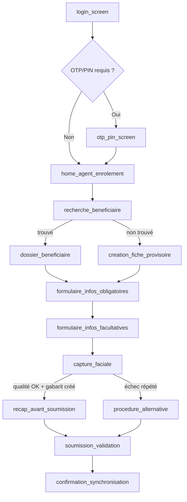
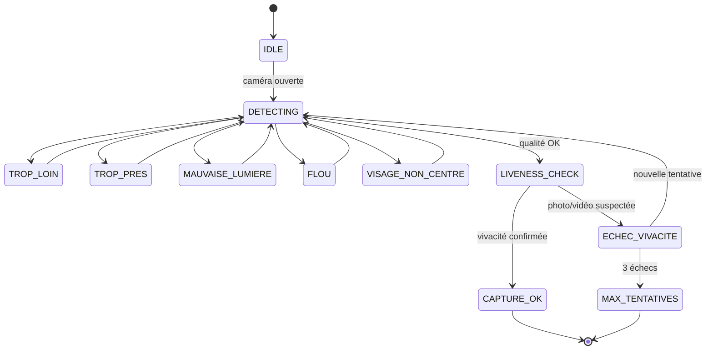
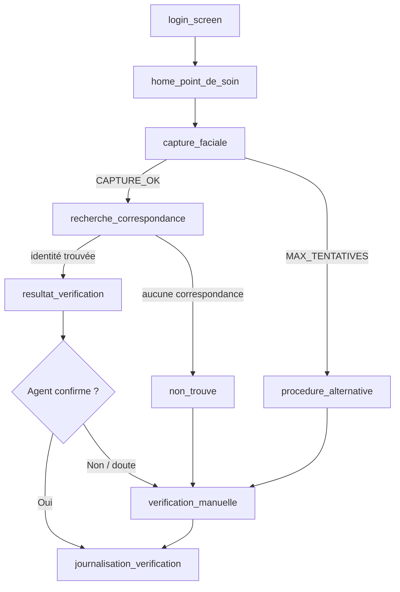
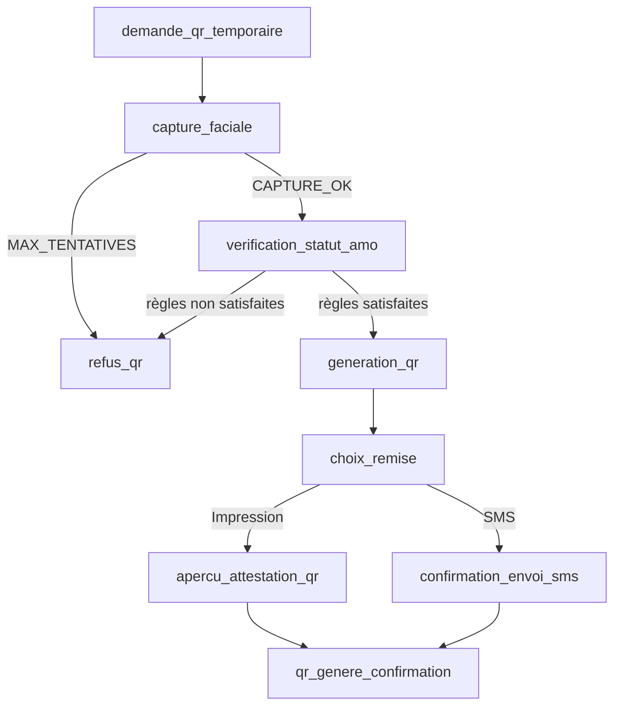
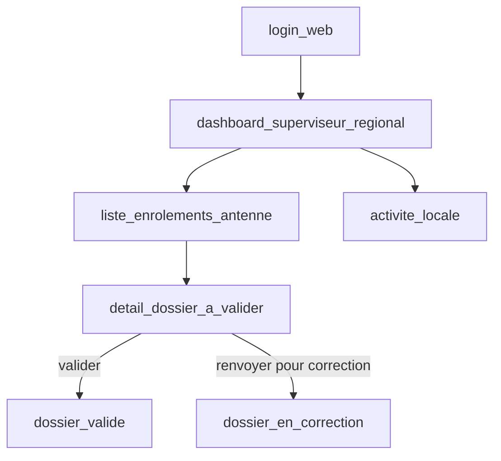
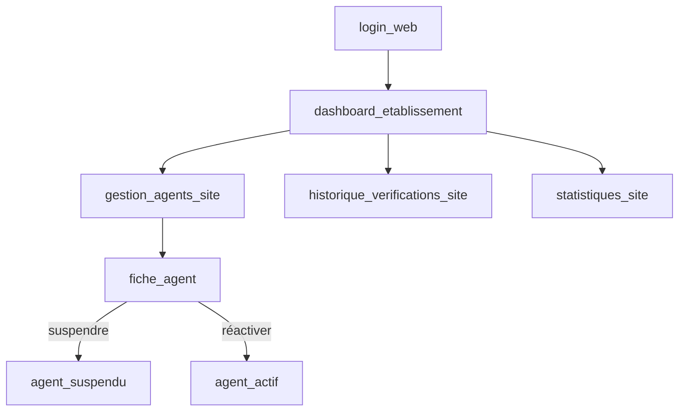
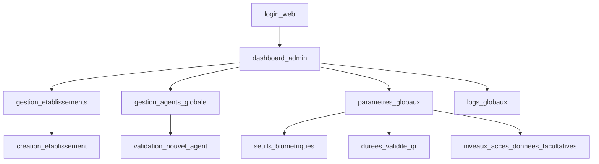
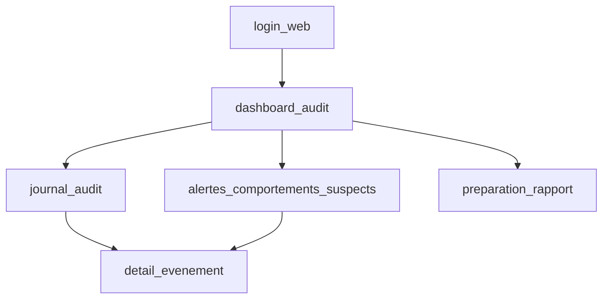

## Avertissement de portée

Ce document **ne redéfinit pas** les règles métier de la spécification (`Spec_AMO_ID_Sante_Mali_MVP_IA.md`).
Il traduit ces règles en **flows d'écrans concrets** : quel écran, quel état, quel message,
quel comportement d'interface, pour chaque étape déjà décrite dans la spec (sections 6, 8, 9, 10, 13).

Décisions techniques déjà validées et réutilisées ici :
- Mobile : React Native, Android prioritaire.
- Back-office : React Router v7.
- API : NestJS + Prisma + Supabase (Postgres/Storage).
- Biométrie : CompreFace (self-hosted) + ML Kit (liveness on-device), toujours proxifié par l'API NestJS.
- TTS : **react-native-tts** (on-device, gratuit, moteur du téléphone), **uniquement pour la capture faciale**.
- Aucune donnée biométrique/médicale dans les logs, réponses API ou QR.

Si un point n'est pas couvert par la spec ou par les décisions déjà validées, il est marqué
`❓ À CONFIRMER` plutôt que d'être deviné.

---

## Table des matières

1. Conventions et légende des états d'écran
2. Flow — Agent d'enrôlement (spec §6.1)
3. Flow — Capture faciale + guidage TTS (spec §8.1) — module partagé
4. Flow — Agent de point de soin / vérification (spec §6.2)
5. Flow — Ayant droit (spec §6.3)
6. Flow — QR temporaire (spec §6.4, §9)
7. Flow — Superviseur régional
8. Flow — Superviseur établissement
9. Flow — Administrateur CANAM/AMO
10. Flow — Auditeur / contrôleur
11. Comportements transverses (offline, erreurs, sécurité)
12. Points à confirmer avant implémentation

---

## 1. Conventions et légende des états d'écran

Chaque écran est décrit avec :

| Champ | Signification |
| --- | --- |
| **Écran** | Nom de l'écran (identifiant technique proposé, `snake_case`) |
| **Rôle(s)** | Qui peut y accéder (spec §5) |
| **États** | États UI possibles (chargement, succès, erreur, vide, etc.) |
| **Actions** | Actions déclenchables par l'utilisateur |
| **Données affichées** | Ce qui est montré — jamais plus que le rôle n'y a droit (spec §12) |
| **Transitions** | Écran suivant selon le résultat |

Légende des états génériques utilisés partout :

- `IDLE` — écran au repos, en attente d'action.
- `LOADING` — appel réseau en cours.
- `SUCCESS` — opération réussie.
- `ERROR_RESEAU` — pas de connexion / timeout.
- `ERROR_VALIDATION` — donnée invalide côté formulaire.
- `ERROR_METIER` — refus fonctionnel (ex. droits suspendus).
- `EMPTY` — aucune donnée à afficher (ex. recherche sans résultat).

---

## 2. Flow — Agent d'enrôlement (spec §6.1)

### 2.1 Vue d'ensemble

### 2.2 Détail des écrans

**`login_screen`**
- Rôle : tous les agents.
- États : `IDLE`, `LOADING`, `ERROR_VALIDATION` (identifiants invalides), `ERROR_RESEAU`.
- Actions : saisie identifiant/mot de passe, bouton "Se connecter".
- Transition : succès → `otp_pin_screen` si MFA activé, sinon `home_agent_enrolement`.

**`otp_pin_screen`**
- États : `IDLE`, `LOADING`, `ERROR_VALIDATION` (code faux), compte à rebours de renvoi de code.
- Actions : saisie code, "Renvoyer le code" (désactivé pendant X secondes), "Valider".

**`home_agent_enrolement`**
- Affiche : nom agent, établissement/antenne, bouton principal "Enrôler / compléter un dossier", accès secondaire à l'historique des dossiers en attente de synchronisation.
- État `EMPTY` si aucun dossier en attente locale.

**`recherche_beneficiaire`**
- Actions : recherche par numéro AMO, NINA (si autorisé), nom/prénom, téléphone (spec §6.1 étape 2).
- États : `IDLE`, `LOADING`, `EMPTY` (aucun résultat → propose "Créer une fiche provisoire"), `ERROR_RESEAU` (bascule recherche en cache local si disponible, avec bandeau "Résultats hors-ligne, peuvent être incomplets").

**`dossier_beneficiaire`** (si trouvé)
- Affiche les champs déjà connus, badges de complétude ("Biométrie manquante", "Infos facultatives absentes").
- Action : "Compléter le dossier" → `formulaire_infos_obligatoires`.

**`creation_fiche_provisoire`** (si non trouvé)
- Formulaire minimal identité, avec mention visible "Fiche provisoire — à valider" (spec §6.1 étape 3).
- Action : "Continuer" → `formulaire_infos_obligatoires`.

**`formulaire_infos_obligatoires`**
- Champs = table §7.1 (identité, références AMO, contact, administratif).
- États : `ERROR_VALIDATION` par champ (bordure rouge + message sous le champ, jamais de blocage silencieux).
- Sauvegarde locale automatique à chaque champ validé (résilience réseau terrain, spec §13).

**`formulaire_infos_facultatives`**
- Champs = table §7.2, chacun avec bascule "Renseigner / Ignorer".
- Bandeau permanent rappelant le principe de prudence (spec §7.2) : "Ces informations sont sensibles, à renseigner uniquement si confirmées."
- Champ libre bloqué si l'agent n'a pas le droit d'accès aux données facultatives (spec §10, module Paramètres → niveaux d'accès).

**`capture_faciale`** → voir section 3 (module partagé, avec guidage TTS).

**`recap_avant_soumission`**
- Résumé lecture seule de toutes les sections + statut qualité de la capture.
- Action : "Soumettre" ou "Revenir corriger".

**`soumission_validation`**
- États : `LOADING`, `SUCCESS`, `ERROR_RESEAU`.
- Si `ERROR_RESEAU` : dossier stocké en file d'attente locale (action queue), badge "En attente de synchronisation" — jamais de perte de saisie (spec §13, §6.1 étape 7).

**`confirmation_synchronisation`**
- `SUCCESS` connecté : "Dossier synchronisé, en attente de validation" ou "Dossier validé" selon rôle validateur.
- `SUCCESS` hors-ligne : "Dossier enregistré localement, sera envoyé automatiquement dès retour réseau."

**`procedure_alternative`**
- Déclenché après échecs répétés de capture (spec §8.1, dernier point ; §13 "visage bandé/blessé").
- Formulaire : motif (liste fermée : blessure, âge, visage couvert pour raison médicale, appareil faible qualité, autre + justification texte).
- Action : "Envoyer pour validation superviseur" → statut dossier passe en `contrôle manuel requis`.

---

## 3. Flow — Capture faciale + guidage TTS (module partagé, spec §8.1)

Ce module est utilisé à deux endroits : enrôlement (§6.1 étape 5) et vérification au point de soin (§6.2 étape 9).
Le comportement est identique ; seul l'écran de résultat diffère (création de gabarit vs comparaison 1:N/1:1).

### 3.1 Machine à états de la capture

### 3.2 Règle de guidage : texte + audio (les deux, comme confirmé)

Chaque état déclenche **simultanément** :
1. un texte affiché à l'écran (toujours visible, ne dépend pas du son) ;
2. une phrase lue par TTS on-device (`react-native-tts`, langue `fr-FR` ou `fr` selon disponibilité sur l'appareil, avec repli sur texte seul si le moteur TTS ne supporte pas le français — `❓ À CONFIRMER` : comportement exact si aucune voix FR n'est installée sur l'appareil).

Le TTS ne doit **jamais** répéter le même message en boucle continue tant que l'état ne change pas
(anti-spam : la phrase n'est relue que si l'état change, ou après un délai de 4 secondes sans amélioration).

### 3.3 Table des messages (état → texte écran → phrase TTS)

| État | Texte écran | Phrase TTS |
| --- | --- | --- |
| `IDLE` | "Positionnez le visage dans le cadre" | "Positionnez le visage dans le cadre." |
| `DETECTING` | "Recherche du visage…" | *(silencieux — pas de TTS sur cet état transitoire)* |
| `TROP_LOIN` | "Rapprochez-vous de la caméra" | "Rapprochez-vous un peu." |
| `TROP_PRES` | "Éloignez-vous légèrement" | "Éloignez-vous un peu." |
| `MAUVAISE_LUMIERE` | "Zone trop sombre / trop de contre-jour" | "Cherchez un endroit mieux éclairé." |
| `FLOU` | "Image floue, gardez l'appareil stable" | "Tenez le téléphone bien stable." |
| `VISAGE_NON_CENTRE` | "Centrez le visage dans le cadre" | "Centrez le visage dans le cadre." |
| `LIVENESS_CHECK` | "Ne bougez plus, vérification en cours…" | "Ne bougez plus." |
| `ECHEC_VIVACITE` | "Vérification échouée, réessayez" | "Vérification échouée, on réessaie." |
| `MAX_TENTATIVES` | "Échec après plusieurs tentatives — procédure alternative disponible" | "Échec de la capture. Vous pouvez utiliser la procédure alternative." |
| `CAPTURE_OK` | "Capture réussie" | "Capture réussie." |

Contraintes non négociables déjà validées, rappelées ici pour l'implémentation de cet écran :
- Aucune image brute n'est envoyée telle quelle au backend au-delà de la création du gabarit (pas de rétention, spec §12).
- L'écran de capture n'appelle jamais CompreFace directement : il passe par l'API NestJS.
- Un bouton "Couper le son" doit être disponible en permanence (accessibilité / contexte salle d'attente bruyante ou silencieuse) — `❓ À CONFIRMER` : ce réglage doit-il être mémorisé par agent, par appareil, ou remis à zéro à chaque session ?

### 3.4 Sortie du module

| Résultat | Écran suivant en contexte enrôlement | Écran suivant en contexte vérification |
| --- | --- | --- |
| `CAPTURE_OK` | `recap_avant_soumission` | `resultat_verification` (comparaison lancée) |
| `MAX_TENTATIVES` | `procedure_alternative` | `procedure_alternative` (§6.2 étape 12 : vérification manuelle / pièce justificative) |

---

## 4. Flow — Agent de point de soin / vérification (spec §6.2)

### 4.1 Vue d'ensemble

### 4.2 Détail des écrans

**`home_point_de_soin`**
- Bouton principal unique : "Identifier un bénéficiaire" (spec §6.2 étape 9).
- Sélecteur de mode si applicable : 1:N (visage seul) ou 1:1 (visage + numéro/QR/carte présentée) — spec §6.2 étape 10.

**`capture_faciale`** → module partagé (section 3).

**`recherche_correspondance`**
- État `LOADING` pendant l'appel API (comparaison biométrique côté serveur, jamais côté mobile).
- Timeout réseau → `ERROR_RESEAU` avec option "Basculer en recherche par numéro AMO/NINA" (dégradation prévue spec §13).

**`resultat_verification`**
- Affiche uniquement (spec §6.2 étape 11, §12 gestion stricte des rôles) :
  - identité probable, score de confiance ;
  - statut AMO (table §8.2) ;
  - type de bénéficiaire (ouvrant droit / ayant droit) ;
  - organisme de rattachement ;
  - lien avec l'ouvrant droit si ayant droit (→ voir section 5).
- Ne jamais afficher : données médicales facultatives à un agent de point de soin sans droit explicite (spec §7.2, §12) — l'écran doit filtrer selon le rôle connecté, pas seulement côté UI mais avec un payload API déjà restreint côté serveur.
- Bandeau de statut coloré selon la table §8.2 :

| Statut backend | Couleur bandeau | Texte |
| --- | --- | --- |
| Identité confirmée + droits actifs | Vert | "Prise en charge possible" |
| Identité confirmée + droits suspendus | Orange | "Droits suspendus — procédure de régularisation" |
| Identité douteuse | Orange | "Doute sur l'identité — nouvelle capture ou contrôle manuel" |
| Bénéficiaire non trouvé | Gris | "Non trouvé — recherche par numéro ou orientation agent CANAM" |
| Ayant droit associé | Bleu | affichage du lien avec l'ouvrant droit |

- Actions : "Confirmer" / "Rejeter — doute" / "Contrôle manuel".

**`non_trouve`**
- Propose recherche manuelle (numéro AMO/NINA/nom) ou orientation vers agent CANAM/AMO (spec §8.2).

**`verification_manuelle`**
- Formulaire : motif du contrôle manuel, pièce justificative (référence, pas de photo brute stockée sans règle définie — `❓ À CONFIRMER` : le contrôle manuel autorise-t-il la prise d'une photo de la pièce d'identité, et si oui avec quelle politique de rétention ?), décision finale de l'agent.

**`journalisation_verification`**
- Écran de confirmation uniquement (pas d'action) : "Vérification enregistrée." Rappelle que sont journalisés agent, établissement, date, résultat, appareil, motif, statut final (spec §6.2 étape 13). Cette journalisation est automatique côté backend, pas une saisie manuelle supplémentaire.

**`procedure_alternative`**
- Même écran que dans le flow enrôlement (section 2), avec motifs adaptés au contexte terrain (spec §13) : visage bandé/blessé, caméra faible qualité, etc.

---

## 5. Flow — Ayant droit (spec §6.3)

Ce flow se déclenche **à l'intérieur** de `resultat_verification` (section 4) ou du dossier bénéficiaire
(section 2), il ne constitue pas un parcours d'entrée séparé.

**`resultat_verification` — variante ayant droit**
- Étapes 14-15 (spec) : capture + identification → si la personne identifiée est un ayant droit, affichage automatique du lien avec l'ouvrant droit (étape 16) : nom de l'ouvrant droit, numéro AMO, organisme, statut de couverture.
- État `ERROR_METIER` si l'ayant droit n'est plus couvert ou nécessite une mise à jour (étape 17) : bandeau orange + bouton "Orienter vers procédure CANAM/AMO" (redirige vers un écran d'information statique, pas un formulaire — la mise à jour du lien de couverture reste un acte CANAM/AMO, pas une action de l'agent de point de soin).

---

## 6. Flow — QR temporaire (spec §6.4, §9)

### 6.1 Vue d'ensemble

### 6.2 Détail des écrans

**`demande_qr_temporaire`**
- Déclenché par l'agent (enrôleur ou point de soin habilité — `❓ À CONFIRMER` : quel(s) rôle(s) exact(s) ont le droit de générer un QR temporaire ? La spec §5 ne le précise pas explicitement rôle par rôle).
- Formulaire motif fermé (spec §6.4 étape 18) : perte, carte abîmée, carte en attente, besoin exceptionnel + justification texte si "besoin exceptionnel".

**`capture_faciale`** → module partagé (section 3), obligatoire avant génération (spec §6.4 étape 19, §9.1 "couplage recommandé").

**`verification_statut_amo`**
- État `LOADING` puis `SUCCESS`/`ERROR_METIER` selon éligibilité.
- `ERROR_METIER` → `refus_qr` avec message explicite (droits non actifs, etc.), sans détail médical.

**`generation_qr`**
- Affiche la durée de validité choisie (spec §9.1 : 24h/72h/7 jours ou durée CANAM) — `❓ À CONFIRMER` : cette durée est-elle un paramètre back-office fixe par établissement, ou un choix laissé à l'agent au moment de la génération dans une liste autorisée ?
- Aucune donnée sensible en clair encodée dans le QR (spec §9.1) — le QR contient un identifiant signé, pas les infos santé.

**`choix_remise`**
- Deux options exclusives : impression (attestation) ou SMS (spec §9, §9.1) — le SMS n'est proposé que si le numéro du bénéficiaire est déjà vérifié dans le dossier.

**`apercu_attestation_qr`**
- Aperçu imprimable avec QR + mention de validité courte + mention "vérification faciale obligatoire au point de soin" (spec §9.1 dernier point).

**`confirmation_envoi_sms`**
- État `LOADING`, `SUCCESS`, `ERROR_RESEAU` (échec envoi opérateur) avec option de réessai ou bascule vers impression.

**`qr_genere_confirmation`**
- Résumé final + rappel que chaque scan du QR sera journalisé (spec §9.1) et qu'il reste révocable depuis le back-office (module QR temporaires, spec §10).

**`refus_qr`**
- Écran d'information, pas de formulaire : motif du refus, orientation vers agent CANAM/AMO si pertinent.

---

## 7. Flow — Superviseur régional (back-office web, spec §5, §10)

Droits : suivre les enrôlements, valider les corrections, contrôler l'activité locale.

**`dashboard_superviseur_regional`**
- Widgets tirés du module Tableau de bord (spec §10) filtrés sur l'antenne/région du superviseur : enrôlements, échecs biométriques, QR temporaires émis dans son périmètre.

**`liste_enrolements_antenne`**
- Table filtrable par statut (fiche provisoire / en attente de validation / validé), agent enrôleur, établissement.

**`detail_dossier_a_valider`**
- Vue lecture des données obligatoires/facultatives selon droit d'accès du rôle, historique des modifications.
- Actions : "Valider", "Renvoyer pour correction" (avec commentaire obligatoire).

**`activite_locale`**
- Liste des agents de l'antenne avec compteur d'actions (spec module Agents, historique d'activité) — sans droit de suspension (réservé Admin/Superviseur établissement selon la matrice §5, `❓ À CONFIRMER` : le superviseur régional peut-il suspendre un agent, ou seulement consulter ?).

---

## 8. Flow — Superviseur établissement (back-office web, spec §5, §10)

Droits : gérer les agents du site, contrôler les vérifications, consulter les statistiques locales.

**`gestion_agents_site`**
- Liste des agents rattachés à l'établissement, appareil(s) autorisé(s) par agent (spec §12 "chaque téléphone/tablette doit être enrôlé, identifiable et révocable").
- Action "Révoquer un appareil" séparée de "Suspendre un agent" (deux actions distinctes, deux impacts différents).

**`fiche_agent`**
- États : `actif`, `suspendu`. Historique d'activité (module Agents, spec §10).

**`historique_verifications_site`**
- Liste des vérifications journalisées (spec §6.2 étape 13) : agent, date, résultat, motif — lecture seule, non modifiable (spec §12 "Logs d'audit… non modifiables").

**`statistiques_site`**
- Indicateurs limités au périmètre de l'établissement (spec §15, sous-ensemble local).

---

## 9. Flow — Administrateur CANAM/AMO (back-office web, spec §5, §10)

Droits : créer les établissements, valider les agents, suivre les logs, paramétrer les règles, suspendre un accès.

**`gestion_etablissements`**
- Liste + création (spec module Établissements §10) : hôpitaux, cliniques, pharmacies, sites pilotes ; statut conventionné ; accès autorisés.

**`validation_nouvel_agent`**
- File d'attente des agents créés en attente de validation admin (spec §5 "valider les agents").
- Action "Valider" déclenche l'activation du compte + assignation rôle + établissement.

**`parametres_globaux`**
- Sous-écrans distincts pour chaque paramètre listé spec §10 module Paramètres :
  - `seuils_biometriques` : seuil de confiance CompreFace (confirmé / douteux / échec).
  - `durees_validite_qr` : valeurs autorisées (24h/72h/7 jours/autre).
  - `niveaux_acces_donnees_facultatives` : matrice rôle × donnée facultative.
- Chaque modification de paramètre doit elle-même être journalisée (spec §12 "journalisation obligatoire… qui a fait quoi") — `❓ À CONFIRMER` : les changements de paramètres système figurent-ils dans le même `audit_logs` append-only que les actions métier, ou dans une table de configuration versionnée séparée ?

**`logs_globaux`**
- Vue globale du module Audit (spec §10) : filtrage par établissement, agent, type d'action, plage de dates. Export de contrôle (mention spec §10 "exports de contrôle") — `❓ À CONFIRMER` : format d'export attendu (CSV, PDF signé, autre) ?

---

## 10. Flow — Auditeur / contrôleur (back-office web, spec §5, §10)

Droits : consulter les journaux, détecter les anomalies, préparer les rapports de contrôle. **Lecture seule.**

**`journal_audit`**
- Lecture seule stricte, aucune action de modification possible sur cet écran (spec §12 "non modifiables par les agents").
- Filtres : agent, établissement, bénéficiaire (référence, pas données sensibles en clair), type d'événement, plage de dates.

**`alertes_comportements_suspects`**
- Liste des alertes automatiques (spec §12 dernier point : scans répétés, échecs multiples, accès hors zone, usage anormal) — l'auditeur consulte, il n'a pas d'action de blocage direct (le blocage reste une action Admin/Superviseur établissement, `❓ À CONFIRMER` : confirmer que l'auditeur ne peut que signaler, pas bloquer).

**`preparation_rapport`**
- Sélection d'un périmètre (dates, établissements) → génération d'un export pour rapport de contrôle (spec §15 catégorie "Contrôle").

---

## 11. Comportements transverses (offline, erreurs, sécurité)

Ces règles s'appliquent à **tous** les écrans mobiles ci-dessus, dérivées de spec §13 et §12.

| Situation | Comportement UI attendu |
| --- | --- |
| Perte de réseau en cours de saisie | Bandeau persistant "Hors ligne — les données seront synchronisées automatiquement", jamais de blocage de la saisie en cours (formulaires, capture faciale restent utilisables). |
| Reprise réseau | Synchronisation automatique en arrière-plan + notification discrète "X dossier(s) synchronisé(s)". |
| Échec biométrique légitime (spec §16) | Toujours proposer `procedure_alternative`, jamais un refus sec sans alternative. |
| Doute sur usurpation (spec §13) | Blocage temporaire de l'action en cours + alerte automatique au superviseur (pas d'action manuelle de l'agent pour "envoyer" l'alerte, c'est automatique). |
| Session inactive | Verrouillage automatique de l'app après un délai — `❓ À CONFIRMER` : durée exacte du délai d'inactivité avant verrouillage. |
| Changement de rôle en cours de session | Non applicable : un compte a un seul rôle actif à la fois (spec §5, pas de changement de rôle dynamique mentionné). |

---

## 12. Points à confirmer avant implémentation

Liste consolidée des `❓ À CONFIRMER` ci-dessus, à trancher avant le développement des écrans concernés :

1. Comportement du TTS si aucune voix française n'est installée sur l'appareil (repli texte seul, message d'avertissement, ou installation guidée de la voix ?).
2. Persistance du réglage "Couper le son" du module de capture (par agent / par appareil / par session).
3. Politique exacte du contrôle manuel en vérification : autorise-t-on la capture d'une photo de pièce d'identité, et avec quelle rétention ?
4. Rôle(s) exact(s) autorisé(s) à déclencher une génération de QR temporaire.
5. La durée de validité du QR temporaire est-elle fixée par établissement (paramètre back-office) ou choisie par l'agent parmi une liste autorisée au moment de la génération ?
6. Le superviseur régional a-t-il un droit de suspension d'agent, ou uniquement de consultation ?
7. Les modifications de paramètres système (seuils biométriques, durées QR, etc.) sont-elles journalisées dans `audit_logs` (append-only, même table que les actions métier) ou dans une table de configuration versionnée séparée ?
8. Format d'export attendu pour les rapports de contrôle (CSV, PDF signé, autre).
9. Confirmation que l'auditeur/contrôleur ne peut que consulter et signaler les alertes, sans droit de blocage direct.
10. Durée exacte du délai d'inactivité avant verrouillage automatique de l'application mobile.

---

*Fin du document. À faire évoluer conjointement avec `AMO_ID_Sante_Mali_Decisions_Techniques.md` au fur et à mesure des réponses aux points de la section 12.*
